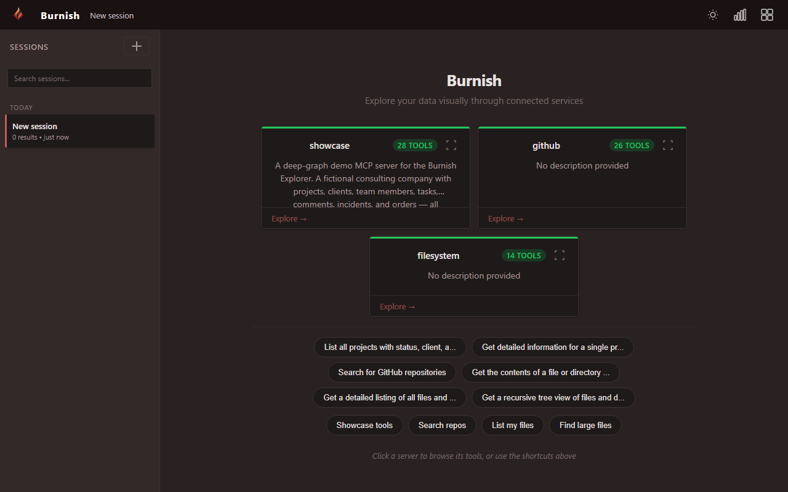
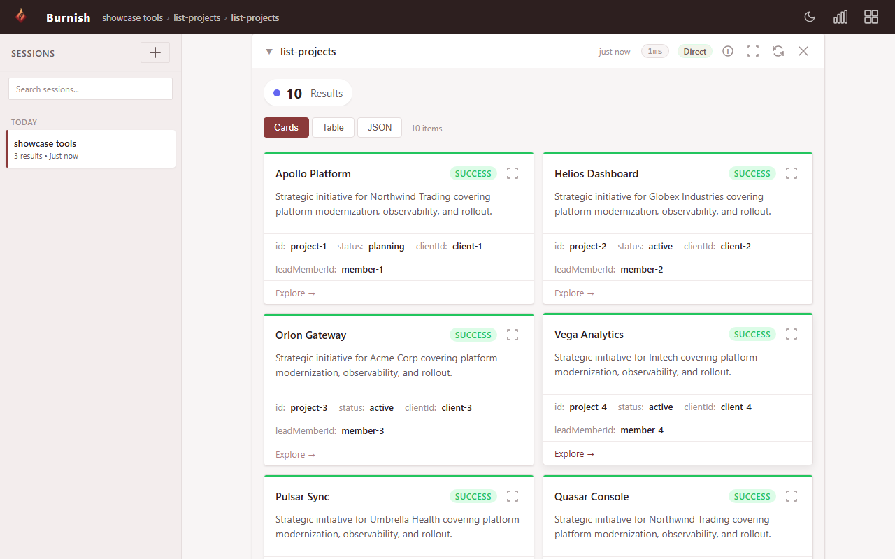

<p align="center">
  <picture>
    <source media="(prefers-color-scheme: dark)" srcset="docs/assets/hero-demo.gif">
    <source media="(prefers-color-scheme: light)" srcset="docs/assets/hero-demo.gif">
    
  </picture>
</p>

<h1 align="center">Burnish</h1>

<p align="center"><strong>Swagger UI for MCP servers.</strong></p>

<p align="center">Explore any MCP server in your browser. No LLM, no API key, no config.</p>

<p align="center">
  <a href="https://www.npmjs.com/package/burnish"></a>
  <a href="https://www.gnu.org/licenses/agpl-3.0"></a>
  <a href="https://github.com/danfking/burnish/actions"></a>
  <a href="https://github.com/danfking/burnish"></a>
</p>

---

## Quickstart

```bash
npx burnish -- npx -y @burnishdev/example-server
```

That's it. Burnish spawns the example MCP server, reads its tool list, opens your browser, and renders every tool as an interactive form. The example server ships with a dozen tools — creating bug reports, listing team members, searching records — so you can click through, fill in forms, and see results rendered as cards, tables, and charts without writing a line of your own MCP code.

Want to try it against a different server? Point `burnish` at any stdio or SSE MCP server — see [What you can point it at](#what-you-can-point-it-at) below.

<p align="center">
  <picture>
    <source media="(prefers-color-scheme: dark)" srcset="docs/assets/quickstart-screenshot-dark.png">
    <source media="(prefers-color-scheme: light)" srcset="docs/assets/quickstart-screenshot-light.png">
    
  </picture>
</p>

Try the hosted demo: **[burnish-demo.fly.dev](https://burnish-demo.fly.dev)**

## Why Burnish?

- **Zero LLM.** No OpenAI key, no Anthropic key, no inference cost. Ever. Explorer mode is 100% deterministic — schemas in, forms out, results rendered.
- **Zero config.** Point `npx burnish` at an MCP server command and it runs. No JSON files, no accounts, no Docker.
- **Zero data leaving your machine.** The CLI runs locally and talks only to the MCP server you pointed it at. No analytics pixels, no telemetry by default.

## Compared to the alternatives

| | Burnish | MCP Inspector | Composio / Rube | Smithery | n8n |
|---|:---:|:---:|:---:|:---:|:---:|
| **Works without LLM** | ✅ | ✅ | ❌ | ➖ | ❌ |
| **Rich visualization** | ✅ Cards, tables, charts | ❌ Raw JSON | ➖ Limited | ➖ Registry only | ➖ Node output |
| **Any MCP server** | ✅ | ✅ | ➖ 500 pre-wrapped | ➖ Browse only | ➖ Custom nodes |
| **Auto-generated forms** | ✅ From schema | ❌ Manual JSON | ➖ Pre-built only | ❌ | ➖ Node config UI |
| **Local / private** | ✅ Fully | ✅ | ❌ Cloud | ❌ Cloud | ➖ Self-host (heavy) |
| **Zero setup** | ✅ `npx burnish` | ✅ `npx` | ❌ Account required | ➖ Browse only | ❌ Docker required |
| **Composable** | ✅ Any server combo | ❌ Single server | ❌ Locked ecosystem | ➖ | ➖ Workflow builder |

✅ Full support · ➖ Partial / limited · ❌ Not supported

## What you can point it at

```bash
# The Burnish example server — richest default demo
npx burnish -- npx -y @burnishdev/example-server

# Any published stdio MCP server
npx burnish -- npx -y @modelcontextprotocol/server-filesystem /tmp

# GitHub (needs a PAT)
GITHUB_PERSONAL_ACCESS_TOKEN=ghp_... \
  npx burnish -- npx -y @modelcontextprotocol/server-github

# An SSE / HTTP MCP server
npx burnish --sse https://your-mcp-server.example.com/sse

# A multi-server config file
npx burnish --config ./mcp-servers.json
```

All configured servers connect at startup. Their tools are available immediately — discoverable, documented, and executable from the browser.

## For MCP server owners

Let your users explore your server without cloning anything. Drop this into your README:

````markdown
[](https://github.com/danfking/burnish)

```bash
npx burnish -- npx @your-org/your-mcp-server
```
````

A hosted "Explore with Burnish" shields.io badge is tracked in [#385](https://github.com/danfking/burnish/issues/385).

Want your tool results to render as cards, tables, and charts instead of raw JSON? See the [Output Format Guide](docs/OUTPUT-FORMAT.md).

## Links

- **Hosted demo** — [burnish-demo.fly.dev](https://burnish-demo.fly.dev)
- **Discussions** — [github.com/danfking/burnish/discussions](https://github.com/danfking/burnish/discussions)
- **Issues** — [github.com/danfking/burnish/issues](https://github.com/danfking/burnish/issues)
- **Registries** — Smithery, Glama, mcp.so listings coming at launch (tracked in [#383](https://github.com/danfking/burnish/issues/383))

## Features

Connect. Browse. Execute. Everything is driven by the server's tool schemas.

- **Instant tool discovery** — every tool listed with its description and input schema
- **Auto-generated forms** — JSON Schema in, interactive form out
- **Rich results** — responses rendered as cards, tables, charts, stat bars, not raw JSON
- **Fully private** — runs locally, no external calls, no telemetry by default
- **Zero config** — `npx burnish` and you're running
- **Drill-down navigation** — collapsible sections and session persistence
- **Framework-agnostic** — standard web components, no React/Vue/Angular lock-in
- **Themeable** — `--burnish-*` CSS custom properties
- **No build step** — import components from CDN as ES modules

## Component reference

10 Lit 3 web components, each driven by JSON attributes:

| Component | Tag | Key Attributes | Purpose |
|-----------|-----|----------------|---------|
| Card | `<burnish-card>` | `title`, `status`, `body`, `meta` (JSON), `item-id` | Individual items with drill-down |
| Stat Bar | `<burnish-stat-bar>` | `items` (JSON: `[{label, value, color?}]`) | Summary metrics / filter pills |
| Table | `<burnish-table>` | `title`, `columns` (JSON), `rows` (JSON), `status-field` | Tabular data with status coloring |
| Chart | `<burnish-chart>` | `type` (line/bar/doughnut), `config` (JSON) | Chart.js visualizations |
| Section | `<burnish-section>` | `label`, `count`, `status`, `collapsed` | Collapsible grouping container |
| Metric | `<burnish-metric>` | `label`, `value`, `unit`, `trend` (up/down/flat) | Single KPI display |
| Message | `<burnish-message>` | `role` (user/assistant), `content`, `streaming` | Chat bubbles |
| Form | `<burnish-form>` | `title`, `tool-id`, `fields` (JSON) | User input / tool execution |
| Actions | `<burnish-actions>` | `actions` (JSON: `[{label, action, prompt, icon?}]`) | Contextual next-step buttons |
| Pipeline | `<burnish-pipeline>` | `steps` (JSON: `[{server, tool, status}]`) | Real-time tool chain visualization |

**Status values:** `success`, `warning`, `error`, `muted`, `info` — mapped to semantic colors via CSS custom properties.

**Action types:** `read` (auto-invoke, safe) and `write` (shows form, requires user confirmation).

## SDK integration

### Middleware

Add Burnish Explorer to your MCP server with one line:

```typescript
import { withBurnishUI } from "burnish/middleware";
await withBurnishUI(server, { port: 3001 });
```

### Schema export

```bash
npx burnish export -- npx @your-org/your-server > schema.json
```

## Use in your own project

### CDN (no build step)

```html
<script type="module"
  src="https://esm.sh/@burnishdev/components@0.3.0"></script>
<link rel="stylesheet"
  href="https://cdn.jsdelivr.net/npm/@burnishdev/components@0.3.0/src/tokens.css" />

<burnish-card
  title="API Gateway"
  status="success"
  body="All systems operational"
  meta='[{"label":"Uptime","value":"99.9%"},{"label":"Latency","value":"42ms"}]'
  item-id="api-gw-1">
</burnish-card>
```

### npm

```bash
npm install @burnishdev/components
```

```javascript
import '@burnishdev/components';

// Components auto-register with burnish-* prefix.
// Custom prefix:
import { BurnishCard } from '@burnishdev/components';
customElements.define('my-card', class extends BurnishCard {});
```

### Renderer

```bash
npm install @burnishdev/renderer
```

```javascript
import { findStreamElements, appendStreamElement } from '@burnishdev/renderer';

const elements = findStreamElements(chunk);
for (const el of elements) {
  appendStreamElement(container, stack, el, safeAttrs, sanitize);
}
```

## Configuration

### MCP servers

Configure in `apps/demo/mcp-servers.json` when running from source, or pass `--config` to the CLI:

```json
{
  "mcpServers": {
    "example": {
      "command": "npx",
      "args": ["-y", "@burnishdev/example-server"]
    },
    "filesystem": {
      "command": "npx",
      "args": ["-y", "@modelcontextprotocol/server-filesystem", "/path/to/dir"]
    },
    "github": {
      "command": "npx",
      "args": ["-y", "@modelcontextprotocol/server-github"],
      "env": {
        "GITHUB_PERSONAL_ACCESS_TOKEN": "${GITHUB_PERSONAL_ACCESS_TOKEN}"
      }
    }
  }
}
```

All configured servers connect at startup. Their tools are available immediately.

## Development

```bash
git clone https://github.com/danfking/burnish.git
cd burnish
pnpm install          # Install all dependencies
pnpm build            # Build all packages
pnpm dev              # Start the demo
pnpm test             # Run Playwright tests
pnpm clean            # Clean all build artifacts
```

```
burnish/
├── packages/
│   ├── components/       @burnishdev/components — 10 Lit web components
│   ├── renderer/         @burnishdev/renderer  — streaming parser + sanitizer
│   ├── app/              @burnishdev/app — drill-down logic + stream orchestration
│   ├── server/           @burnishdev/server — MCP hub + guards + intent resolver
│   └── cli/              @burnishdev/cli — npx burnish launcher
├── apps/
│   └── demo/
│       ├── server/       Hono API
│       └── public/       SPA shell (ES modules, no framework)
└── package.json          pnpm workspace root
```

### Prerequisites

- Node.js 20+
- [pnpm](https://pnpm.io/) 9+

## How it works

```
    ┌──────────────────────────────────┐
    │        MCP Servers                │
    │  (filesystem, GitHub, DB, ...)    │
    └──────────────┬───────────────────┘
                   │ tool calls / results
                   ▼
    ┌──────────────────────────┐
    │  Schema-Driven UI        │
    │                          │
    │  • List tools             │
    │  • Generate forms         │
    │  • Map results → comps    │
    └──────────┬───────────────┘
               │
               ▼
    ┌──────────────────────────┐
    │  Streaming Renderer      │
    │                          │
    │  • Parse tags on arrival  │
    │  • Sanitize (DOMPurify)  │
    │  • Append to DOM         │
    └──────────┬───────────────┘
               │
               ▼
    ┌──────────────────────────┐
    │  Web Components (Lit 3)  │
    │                          │
    │  • Shadow DOM isolation  │
    │  • JSON attribute parsing│
    │  • Event-driven drill-   │
    │    down navigation       │
    └──────────────────────────┘
```

Burnish reads the MCP server's tool list, generates forms from JSON Schema, and maps results directly to components — no LLM in the loop. Everything runs locally.

## Coming soon: Navigator

Navigator is the planned LLM-powered natural-language layer over Explorer mode — ask a question and Burnish picks the right tools across your connected servers, rendering the answer with the same components you see today. Explorer mode (what you use now) stays free, local, and zero-LLM.

[Join the waitlist →](https://github.com/danfking/burnish/discussions/389)

## Privacy & Telemetry

Burnish collects **opt-in**, anonymous telemetry to measure real adoption (see [issue #382](https://github.com/danfking/burnish/issues/382)). It is **off by default**. On the first interactive run of the CLI you'll see a prompt asking whether to enable it — pressing Enter or anything other than `y` keeps it off.

**What we send (only if you opt in):**

- `v` — burnish CLI version
- `os` — OS family: `darwin`, `linux`, `win32`, or `other`
- `node` — Node.js major version
- `bucket` — coarse invocation-count bucket: `1`, `2-5`, `6-20`, or `21+`
- `id` — a random install ID (UUID) generated once on first opt-in
- `schema_version` — payload schema version (currently `"1"`)

**What we never send:** server URLs, tool names, schemas, arguments, file paths, hostnames, usernames, IP addresses we can see beyond the TCP connection, or any content from your MCP servers. There is no per-tool or per-schema tracking.

**How to opt out at any time:**

1. Set the environment variable `BURNISH_TELEMETRY=0` (also accepts `false`, `off`, `no`). This overrides any stored choice.
2. Or delete / edit the stored choice file:
   - macOS / Linux: `~/.config/burnish/telemetry.json` (honors `$XDG_CONFIG_HOME`)
   - Windows: `%APPDATA%\burnish\telemetry.json`

Telemetry is a single fire-and-forget HTTPS POST to `https://burnish-demo.fly.dev/telemetry/v1/ping` with a short timeout. If the endpoint is unreachable, the CLI behaves identically — nothing is retried or queued. Telemetry is skipped entirely in non-interactive and CI environments when no choice has been stored.

## License

[AGPL-3.0](LICENSE) — Daniel King ([@danfking](https://github.com/danfking))
